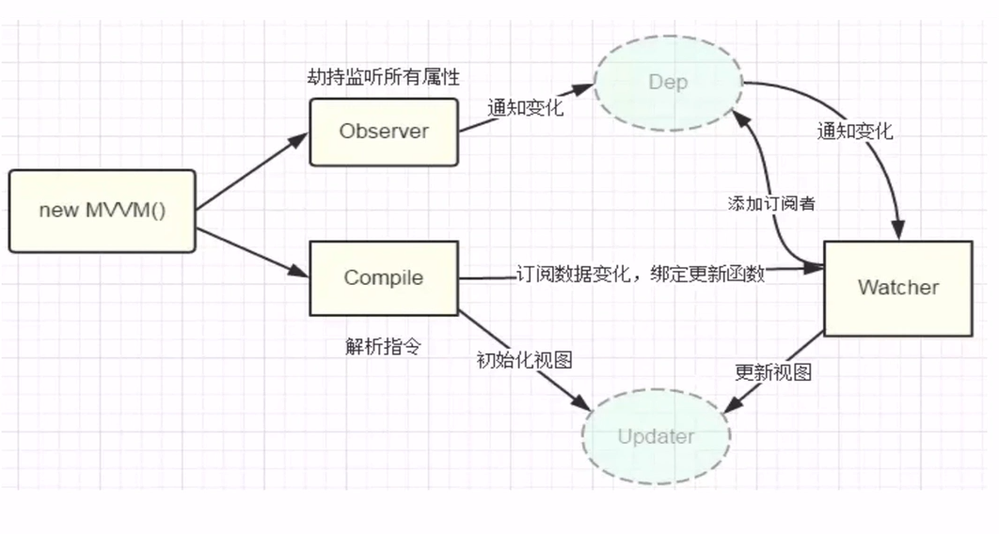

## MVVM响应式原理
### 1.vue的数据劫持的相关概念
数据劫持结合发布者-订阅模式，劫持各个属性的`setter`和`getter`,在数据变动时发布消息给订阅者。触发响应的监听回调

回答：

- 找到入口函数，传进来一些数据，通过`object.defineProperty()`劫持监听所有的属性，数据发生变化，通知订阅器找到对应的订阅者更新对应的视图
- 订阅器的作用：
  - 通知watcher更新视图
  - 存放多个订阅器
- watcher 的作用：
  - 更新视图
- Observer的作用：
  - 通过`object.defineProperty()`劫持监听所有的属性
- Compile的作用：
  - 解析指令

### 2.实现指令解析器Compile

### 3.实现数据的监听器 Observer

### 4.实现一个观察者watcher更新视图

### 5.实现一个proxy代理

### 6.面试题

